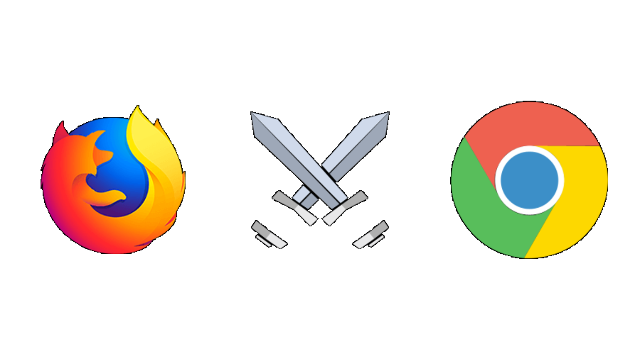

# **Ben Goodger - The Creator of Enemies**
 
Ben Goodger was born in London England but grew up in New Zealand. His contribution to the world of Computer Science is Google Chrome and Mozilla Firefox. Which as you can imagine are quite the same yet so different. Google Chrome and Mozilla Firefox are two of the most popular and widely browsers in the world. I found Ben very interesting for the fact that he was a founding member on both very common applications.

### Early Career
Ben started his career as a software engineer by studying Computer Systems Engineering at The University of Auckland in which he graduated with a Bachelor of Engineering in 2002. Prior to his graduation Goodger worked as an intern for Netscape Communications Corporation. He started as an intern in the Navigator group who were the owner of Mozilla user interface module in 2000-2001. Ben originally got involved in Netscape Navigator via their open sourcing of the project. 

Netscape Navigator was the original browser of the Netscape line. It was the flagship project from Netscape. In the 1990’s it was the dominant web browser in terms of usage share. Navigator was very well positioned for the consumer Internet revolution and seized its opportunity.

At Netscape he implemented several components of the Netscape 6/Mozilla interface including refinements to the general look and feel. He also worked to improve the performance of the application and functionality. It was at Netscape where Goodger honed in his skills in web development and design. 
Towards the end of his time at Netscape circa 2003, Goodger was focused on research and development of client software for social asset sharing and management. This furthered his fundamental understanding of web browser design and implementation. 

### Mozilla Firefox
Firefox began as an experimental branch of the Mozilla project. Mozilla Suite began to suffer from bloating and the Mozilla browser was suffering from this as its utility was being compromised. In around April 2003 the Mozilla Organization then decided to focus on Firefox. It was originally named Phoenix and then after copyright issues was renamed to Firebird and then later, Firefox. The name Phoenix was originally given as the browser was seens as a bird which rose triumphantly from its dead predecessor which in this case was Netscape Navigator. Netscape Navigator was a victim of the First “Browser War”. 

At the time Goodger joined Mozilla, the team were in the process of switching from their older Legacy Netscape rendering engine to the newer Gecko engine. As part of that switch there was the decision made to design an entire new user interface for the browser. Goodger was then chosen to be Lead Engineer on the Firefox web browser. Goodger laid out a schedule and a plan and then his execution of said schedule and plan alongside a community of volunteers and paid workers at the Mozilla Foundation was instrumental in the world of web development.

Some of the key features in which Ben Goodger developed for the release of Firefox 1.0 was the extension management system which Firefox was renowned for upon its release into an increasingly competitive browser market. Some of those competitors included Opera and Microsoft’s Internet Explorer. 

Goodger developed new features and maintained Mozilla Firefox for 3 years as the Lead Engineer. He conceived many key features and improvements for the release of Firefox 1.5 and Firefox 2.0. While Goodger was working on Firefox, Firefox were gaining market share on Internet Explorer due to the fact Firefox had fewer known security vulnerabilities. Firefox on average were fixing one vulnerability per day compared to one vulnerability every nine days at Internet Explorer.

### A Googol of Potential
In early 2005, the web browser market was very competitive with the two major players being Microsoft’s Internet Explorer and Mozilla Firefox. At the time Google, who were growing rapidly and were in a constant competition across many products with Microsoft, were contemplating entering the web browser market. However, Google CEO, at the time, Eric Schmidt opposed the development of an independent web browser as he didn’t see the possibility that Google could touch Microsoft’s dominance in the market. 

At his time, Goodger and his relatively small team worked constantly to iterate on Mozilla Firefox which included the release of Firefox 1.5 and Firefox 2.0. After these releases Mozilla took a substantial bite into Microsoft’s market share and were looking extremely promising. Amongst the ongoing browser battle between Internet Explorer and Firefox and several other browsers, speculation was mounting on whether Google would enter the market. Throughout 2004 and 2005 rumours were circulating that Google had plans to build their own browser to beat Internet Explorer. It is believed that Google founders Larry Page and Sergey Brin saw the growth of Firefox as a sign that Microsoft’s grip on the market was not as strong as believed to be. Page and Brin then decided to hire several Mozilla Firefox developers. Among these developers was Goodger. The team of developers quickly got to work and created a demonstration of Google Chrome. Eric Schmidt said that “it was so good that it essentially forced me to change my mind”. 

### Google Chrome Beginnings
Goodger announced via his blog that he took a job with Google on January 10th, 2005. This fuelled the ongoing speculation of Google entering browser market. Goodger was a part of the team that developed the initial demonstration of Chrome. Development began around 2006 under the name “Chrome” which they later adopted as the final release name. Goodger was a founding member of the Chrome team. Goodger was placed as the lead of the User Interface team. Goodger was quoted as saying that he joined Google to create a brand new and innovative browser because “browsers suck”. Goodger said this because at that time browsers began to slow down, crash often and a heap of security issues.

Goodger was quoted as saying that one of the main reason’s browsers began to “suck” was the fact that their User Interfaces were becoming “more and more bloated”. He believed that Google was the place to be to create a brand new efficient and aesthetically pleasing browser which was both user friendly and perform extremely well.  The ambition Google had to re-architect the browser was the key reason Goodger joined the team.

The key mantra the Goodger and his UI team chose to follow was “content not Chrome”. Which Goodger late acknowledged how ironic it is given the browsers name. Goodger wanted to strip down the UI and minimalize it so the content on the web page was more prevalent. The UI Goodger helped to develop had many key differences compared to other browsers such as a lack of any menu buttons and “attention-grabbing” popups. Goodger and his team also followed the idea of having “fewer options better defaults”.

### Google Chrome 1.0
Google Chrome was announced in 2008 as Google’s entry onto the browser market. The team at Chrome promised to make a big dent into the browser market. Google sent out a cartoon book to journalists to announce and showcase the unique features of Chrome. This was not only a marketing strategy but also showcased the character the team at Google had. For instance, on the task manager for chrome there is a button linking to more performance stats for each individual task being run on Chrome, this button is affectionately labelled as “stats for nerds”. This playful attitude certainly helped the initial reception of Chrome which was generally positive although a lot of the new features and ground-breaking redesigns were to fix problems that many ordinary people didn’t know they even had.

The browser was publicly released on September 2nd, 2008 for Windows XP. Chrome quickly grew to around 1% market share. Upon its release many reviewers cited the UI as the most notable move. Goodger and his team’s new minimalistic UI was a big hit with ordinary users.

Google Chrome took over from Internet Explorer as the most used browser in 2012 and has not lost that title since. It has a 66.68% market share as of the writing of this essay.

 
### Conclusion
Ben Goodger still works on the Google Chrome browser as General Manager for the Web Platform team. He describes himself as a “seasoned browser software engineer and enthusiast”. Goodger’s impact on the average person’s life is quite confounding when you think about it. Many people don’t even think about their browser and simply just use whatever comes preinstalled on their devices. I believe that the impact these browsers have had on not only the tech industry but every industry is never going to be understated as every byte of information that flows through the world wide web would not be accessible on the scale it is if it weren’t for the popularity of browsers like Firefox and Chrome.

Ben Goodger had a huge hand in creating some of the most used software on the planet and nearly no one knows his name. Ben’s name is not mentioned once on either Firefox or Chrome’s Wikipedia page. He created two hugely competitive browsers and enhanced the capabilities of so many ordinary people.

___

## Sources

* Ben Goodger's LinkedIn Profile: https://www.linkedin.com/in/bengoodger/

* Ben Goodger on Wikipedia: https://en.wikipedia.org/wiki/Ben_Goodger

* FLOSS Weekly Podcast with Ben Goodger: https://twit.tv/shows/floss-weekly/episodes/2

* NZ Herald article on Ben Goodger: https://www.nzherald.co.nz/technology/kiwi-leads-effort-to-build-a-better-browser/WER7KZF6ZLJI46X5QGL5Q4F2BQ/

* CNet article on Ben Goodger's move to Google: https://www.cnet.com/news/google-snaps-up-top-firefox-programmer/

